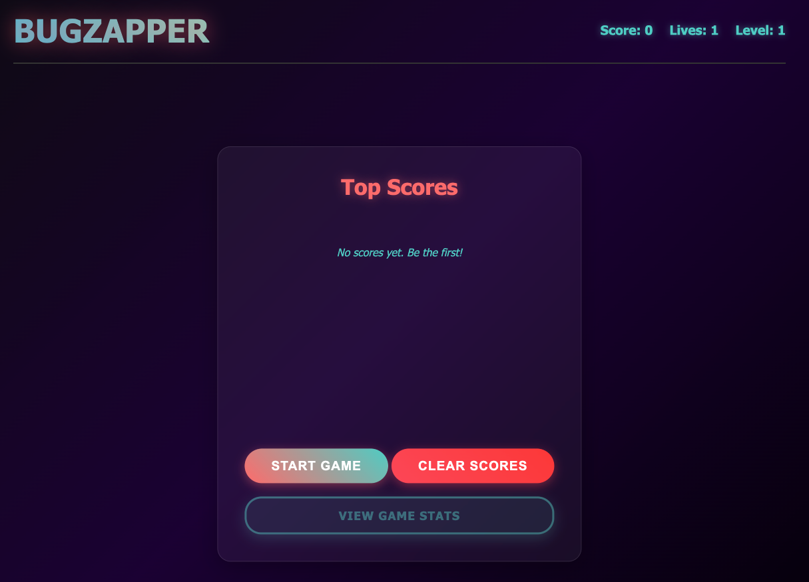
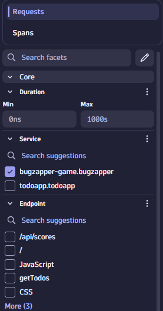
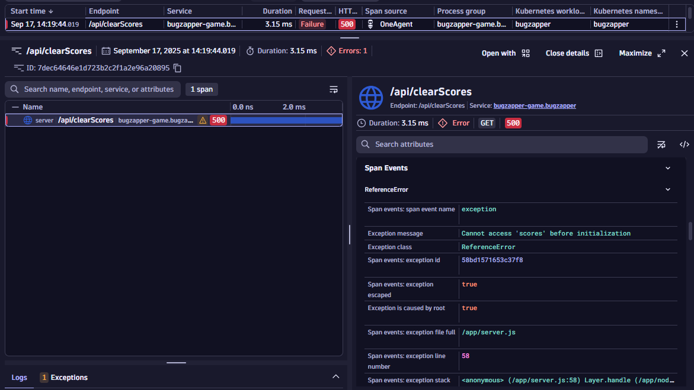
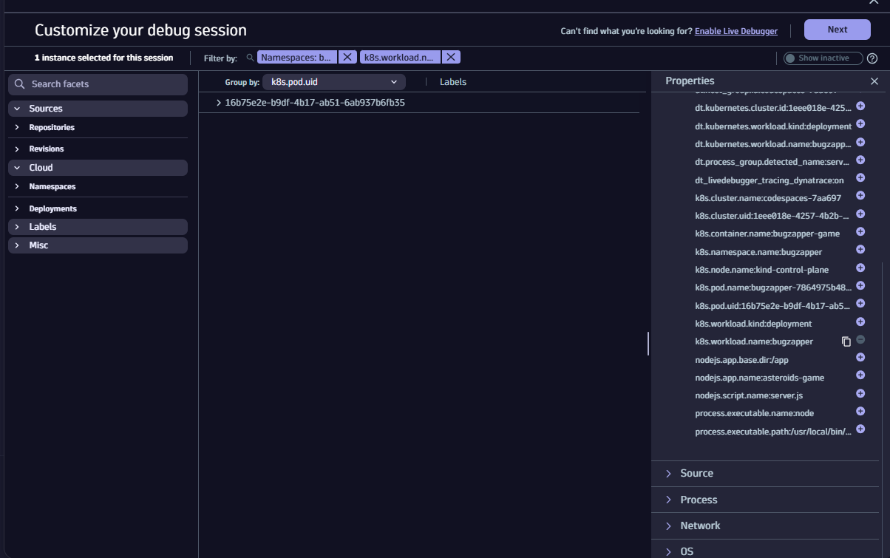
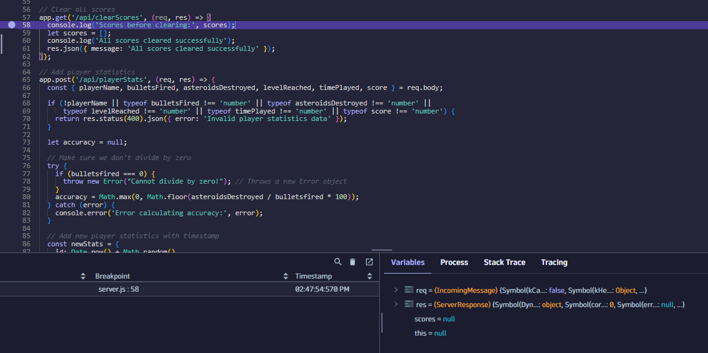
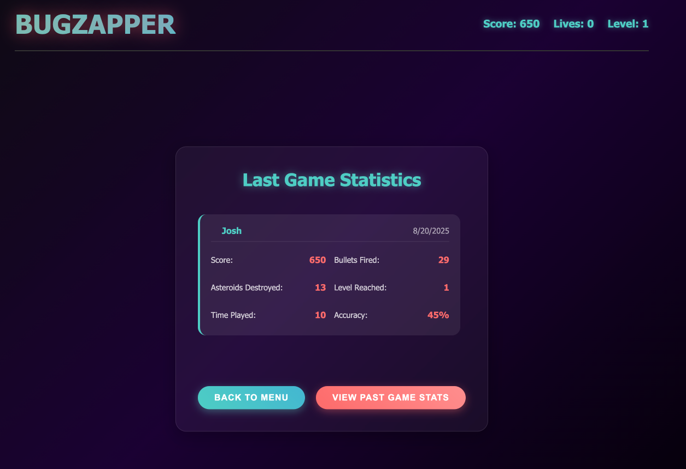
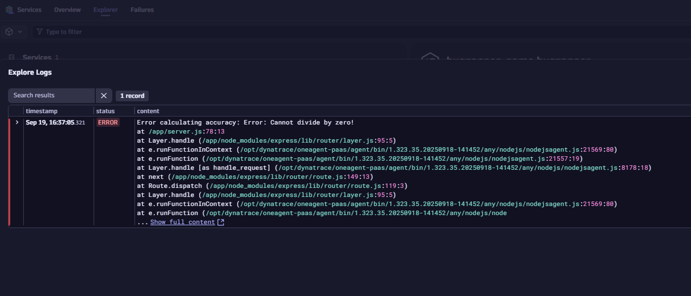

--8<-- "snippets/bugzappers-bugs.js"

## Bug 1: Why are the top scores not being cleared?
There are a few bugs in the Bugzapper app and your mission is to find them by investigating the application and using Dynatrace to help your investigation.

Open the bugzappers game in your browser (if its not open, go to the codespaces 'Ports' tab and open the app on port 30200 in your browser)

To start, play a game to make sure there are some top scores on the scoreboard:



**Hints**

- Try to clear the scores from the Top Scores. What do you notice?
- Try to use the Distributed Tracing App to understand which API calls are being made. Filter on the `bugzapper-game.bugzapper` service. Press 'ctrl/cmd + K' in Dynatrace and type 'Distributed Tracing' to find the app.



- Use the Live Debugger to set a breakpoint in the part of the code that's responsible for clearing the scores. Press 'ctrl/cmd + K' in Dynatrace and type 'Live Debugger' to find the app. Click the purple pencil icon to set a Live Debugger filter. Use the `bugzapper` namespace as the filter. The source code repository should populate automatically. 

<br>
<details>
<summary>Solution</summary>

---
### Step 1 — Find the exception
After trying to clear the scores, you should have seen an error in the console. The error is caused by an incorrect initialization of the `scores` variable in the `clearScores` function.



---
### Step 2 — Let's start our debugging session
From the trace detail, we can see that the error occurs in the `clearScores` function on th `/app/server.js` file on line 58.

Let's create a debugging session:
1. Open the 'Live Debugger' app
2. Match the following values:
    - Namespace: `bugzapper`
    - Properties: `k8s.workload.name:bugzapper`



3. Click on Next & Done
4. The code repository should populate automatically
5. Set up a breakpoint on line 58 and try to clear the scores again. This should trigger the breakpoint and capture a snapshot. Let's see what the snapshot tells us about our `scores` variable.

---
### Step 3 — Fix it
Notice the global variables `scores` is being initialized again as a local variable.



```javascript
// Clear all scores
app.get('/api/clearScores', (req, res) => {
  console.log('Scores before clearing:', scores);
  //let scores = [];
  scores = [];
  console.log('All scores cleared successfully');
  res.json({ message: 'All scores cleared successfully' });
});
```
---
</details> 
<br>

## Bug 2: Why are the past game stats not showing up correctly?
Now that you've played a game, you can view your game stats by clicking on the `View Game Stats` button.



Now click on `Past Game Stats` to view the past game stats. What do you notice?

***Hints***

- Try to use the Distributed Tracing App to understand which API calls are being made. Filter on the `bugzapper-game.bugzapper` service.
- Go to the `bugzapper-game.bugzapper` Game service in the `Services` app and check out the Logs. Notice there are some failures. Press 'ctrl/cmd + K' in Dynatrace and type 'Services' to find the app
- Based on the error logs, use the Live Debugger to set a breakpoint in the part of the code that is responsible for storing the game stats when a game ends.

Did you find the bugs? Great job. Let's move on to the next app.

<br>
<details>
<summary>Solution</summary>

---
### Step 1 — Inspect the logs
From the `Services` app, navigate to the `bugzapper-game.bugzapper` service and check out the logs. Notice there are some failures.




---
### Step 2 — Let's debug

Find the `/api/playerStats` endpoint and set a breakpoint.

Try to play a game again and check the `View Past Game Stats` again. This should trigger the breakpoint and capture a snapshot. Let's see what the snapshot tells us about our `accuracy` variable.


---
</details> 
<br>

<div class="grid cards" markdown>
- [Let's Find More Bugs in the Todo App:octicons-arrow-right-24:](2-todoapp-bugs.md)
</div>