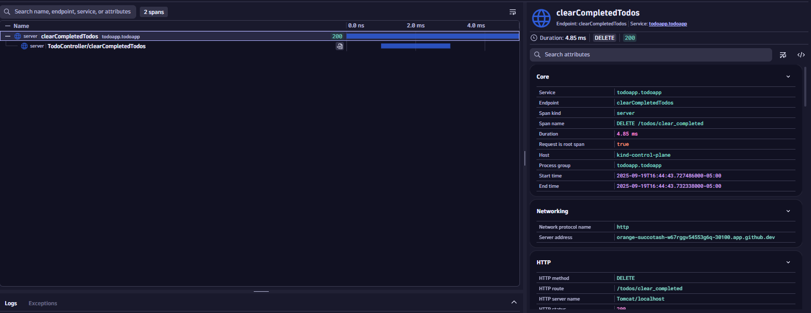
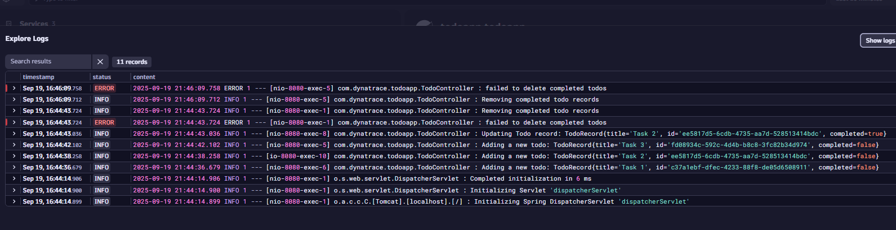
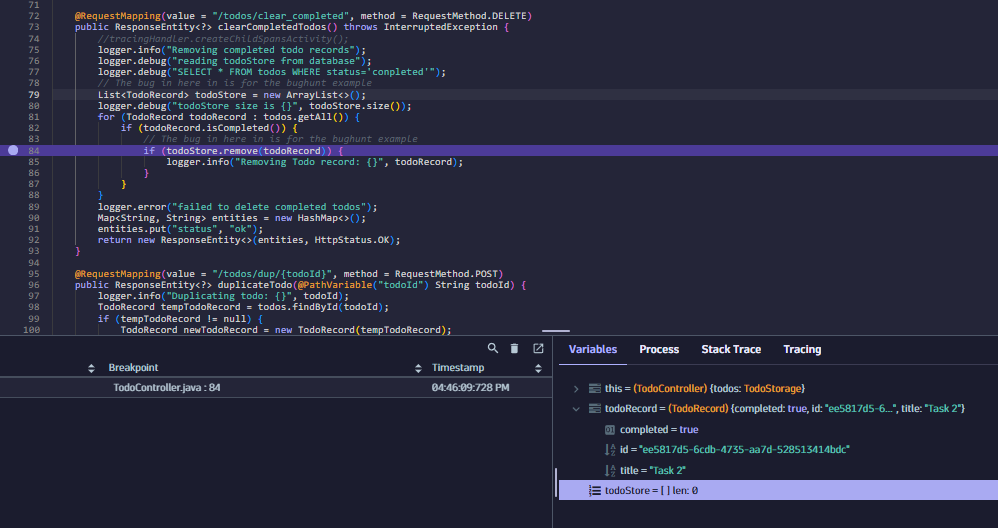
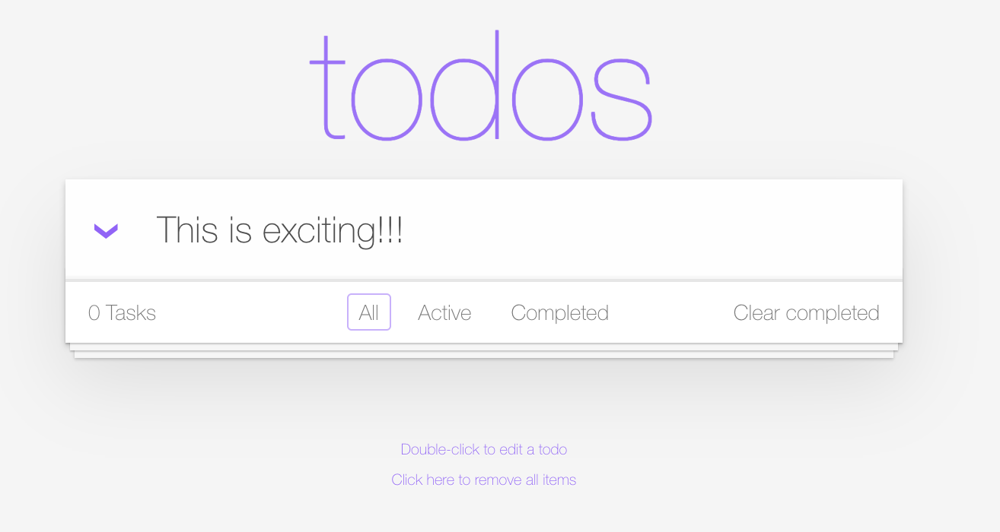
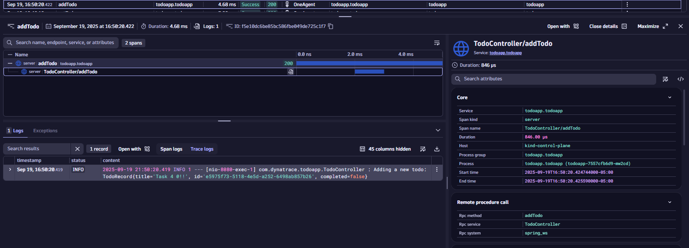
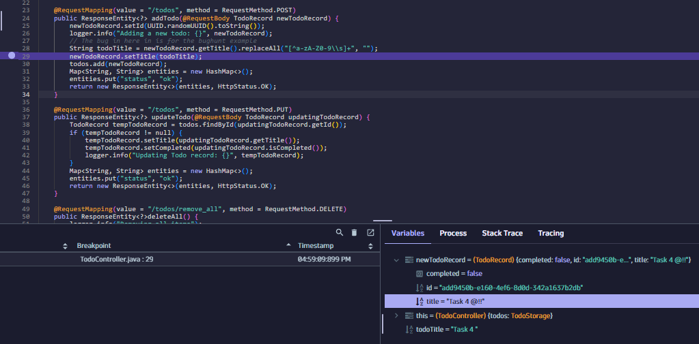

--8<-- "snippets/3-codespaces.js"

## Bug 1: Todo App - Clear completed tasks

Now that you're an expert bug finder from finding bugs in the Bugzapper game, let's look at another app - the Todo App. There are a few bugs in the app that we'll need to investigate.

- Open the Todo app
- Add a few tasks
- Complete some of them by clicking to the left of the task
- Clear the completed tasks

What happens?


***Hints***

- Open up the distributed traces app to make sure API calls work as expected and understand which calls were made to the backend. Press 'ctrl/cmd + K' in Dynatrace and type 'Distributed Tracing' to find the app.
- Open the Live Debugger to set a breakpoint in the the function called when you clear Todos. Press 'ctrl/cmd + K' in Dynatrace and type 'Live Debugger' to find the app. Click the purple pencil icon to set a Live Debugger filter. Use the namespace `todoapp` as your Live Debugger filter.
- Why are the Todo tasks not getting cleared after looking at the code?

<br>
<details>
<summary>Solution</summary>

---
### Step 1 — Find the endpoint
When we click the 'Clear completed' button, a request is sent to the backend to clear the completed tasks. Let's use distributed tracing to find out which endpoint is being called.



You can also check the logs:



---
### Step 2 — Let's start our debugging session
We can see that the endpoint being called is `/todos/clear_completed`. Let's find this in the code and set a breakpoint to see why the tasks are not being cleared.

Let's create a debugging session:
1. Open the 'Live Debugger' app
2. Match the following values:
    - Namespace: `todoapp`
    - Properties: `k8s.workload.name:todoapp`
3. Click on Next & Done
4. The code repository should populate automatically
5. Set up a breakpoint and see what happens when you click the 'Clear completed' button.



---
### Step 3 — Fixing the bug
Notice that a new empty array list is being created and that's the one that is being cleared instead of the existing list of todos.

Try fixing the code. Hint:

Before:
```javascript
List<TodoRecord> todoStore = new ArrayList<>();
logger.debug("todoStore size is {}", todoStore.size());
for (TodoRecord todoRecord : todos.getAll()) {
    if (todoRecord.isCompleted()) {
        if (todoStore.remove(todoRecord)) {
            logger.info("Removing Todo record: {}", todoRecord);
        }
    }
}
```

After:
```javascript
//List<TodoRecord> todoStore = new ArrayList<>();
//logger.debug("todoStore size is {}", todoStore.size());
for (TodoRecord todoRecord : todos.getAll()) {
    if (todoRecord.isCompleted()) {
        if (todos.remove(todoRecord)) {
            logger.info("Removing Todo record: {}", todoRecord);
        }
    }
}
```
---
</details> 
<br>

## Bug 2: Todo App - Special characters disappearing

Let's add a todo task with some special characters such as exclamation points.

What do you notice? Where is the bug?



***Hints***

- Use the distributed tracing app to filter traces based on the app name, kubernetes namespace, or workload names to see which services are being called. Press 'ctrl/cmd + K' in Dynatrace and type 'Distributed Tracing' to find the app.
- Use the Live Debugger to set a breakpoint in the part of the code you found to analyze the data. Press 'ctrl/cmd + K' in Dynatrace and type 'Live Debugger' to find the app. Click the purple pencil icon to set a Live Debugger filter. Use the namespace `todoapp` as your Live Debugger filter.
- What's happening to the todotitle as it gets added to our list of todos?

<br>
<details>
<summary>Solution</summary>

---
### Step 1 — Find the endpoint
Find the endpoint that is being called when you add a new todo task with special characters using distributed tracing. Notice the log content.



Note: You can see the log content on the trace as long as you have log enrichment enabled.

---
### Step 2 — Let's debug
We can see that the endpoint being called is `POST /todos`. Let's find this in the code and set a breakpoint to see what's happening with the task name:

Hint: Notice what happens with the `todoTitle` variable.



---
### Step 3 — Fixing the bug
Notice this two code lines:

```java
String todoTitle = newTodoRecord.getTitle().replaceAll("[^a-zA-Z0-9\\s]+", "");
newTodoRecord.setTitle(todoTitle);
```
The task is being stripped of special characters before adding it to the list.

Try fixing the code.

---
</details> 
<br>

<div class="grid cards" markdown>
- [Cleanup:octicons-arrow-right-24:](cleanup.md)
</div>